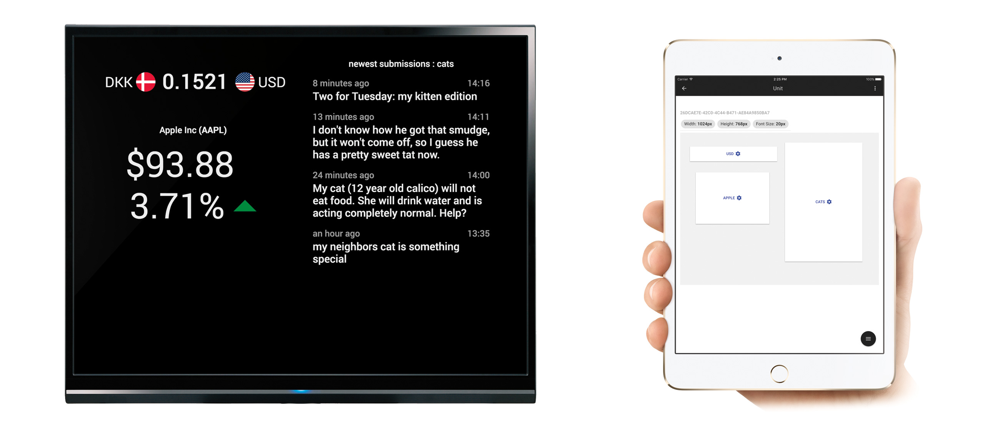
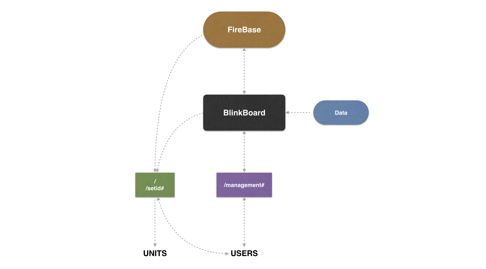

# BlinkBoard (beta)

## Web-based Dashboard Platform



### Introduction

BlinkBoard is a lightweight administration platform for web-based dashboards. Imagine you have an old monitor in spare, perhaps a Raspberry Pi you don't know what to do with - BlinkBoard lets you transform this setup into a slick dashboard. By now, you're probably wondering, what kind of information you want to display on such a dashboard. Well, the architecture allows for anything, really, and I've included a few sample _viewers_ (as I call them) to show how they function. And you have to build these yourself. Viewers are simply Angular directives with specific parameters. BlinkBoard simply makes the administration of these settings along with placement on the monitor easy.

### Dependencies

In its current form, BlinkBoard uses Google's [FireBase](https://www.firebase.com/) as its database, but only makes use of the realtime-API on the dashboard hosting device, so it could be changed to use any sort of database without too much work. The platform runs as a Node.js server, so along with the before mentioned monitor and Raspberry Pi, you do need a server as well. Other than that, you just need NPM to install and run the platform.

### Installation

Having cloned the repository, you now need to create a [FireBase](https://www.firebase.com/) app. Having created an _app_, you need to enable email-authentication and create a user. When finished you have the information needed in order to setup the environment variables. Create a file called `.env` in the root 'BlinkBoard' directory and fill it out as follows:

```
FIREBASE_APIKEY=[insert Google project API key]
FIREBASE_AUTHDOMAIN=[insert Firebase domain (e.g. myapp.firebaseio.com)]
FIREBASE_DATABASEURL=[insert Firebase url (e.g. https://myapp.firebaseio.com/)]
PORT=[insert the port you want to use (e.g. 80)]
```

Now you need to add the rules provided in the `rules.json` file to the app in the [FireBase](https://www.firebase.com/) administration system. Just copy paste them and save. Currently, you also need to import the `viewers.json` file into the database. This contains information about the available viewers, which I will explain in the _How to Use_ section below.

To install the app, simply run `npm install` and wait it out. You can also run it in a Docker container using the command `docker build -f Dockerfile -t blinkboard --rm=true .` Either way, you can afterwards start the application using the command `gulp` if developing, or `npm start` if in production.

There is currently no custom user-management, so just use FireBase' online controlpanel for now.

### How to Use

The structure of BlinkBoard consists of 3 objects:

- `Users` are the people with their own login credentials. A user can manage any number of `units`.
- `Units` are the clients displaying the dashboard. A `unit` is defined by its unique `unitID`, which is set in the browsers `LocalStorage` using the `/setid#` entrypoint. Once a `unit` is added by any `user`, it will forever exists in the database. `Users` do not own `units`, thus multiple `users` can manage the same `unit` at the same time.
- `Viewers` are the modules being displayed on the dashboards and are defined in the `viewerModels` database-object. A `viewer` instance is owned by a `unit`.



When running the server, 3 endpoints become available:

- `/setid#` should only be used once, when adding a dashboard. In order for the dashboard hosting device (e.g. raspberry pi) to know what to display, it has to have a unique `unitID`. This ID is stored in the browsers `LocalStorage` and can be set or regenerated at this endpoint (point the raspberry pi's browser to this).
- `/` is where the actual dashboard is displayed. As such, when you for instance open a browser on your dashboard hosting device, just by pointing it to the address of the server, it should display the dashboard.
- `/management#` is where you manage your dashboards. You login using your FireBase credentials and add the units (dashboards) you want to manage. Any change you make here should automatically be reflected on the units. This is what makes BlinkBoard easy.

### How to Add Viewers

As previously mentioned, viewers are simply Angular directives with parameters. The outlines of these parameters are defined in the `viewerModels` database-object, so by adding to this, you can define your own. Look at the sample viewers in `public/viewers/` for inspiration. Please take note that currently you need to refresh the dashboard hosting device after having added a new viewer type, as directives are dependencies of Angular on initialization.
